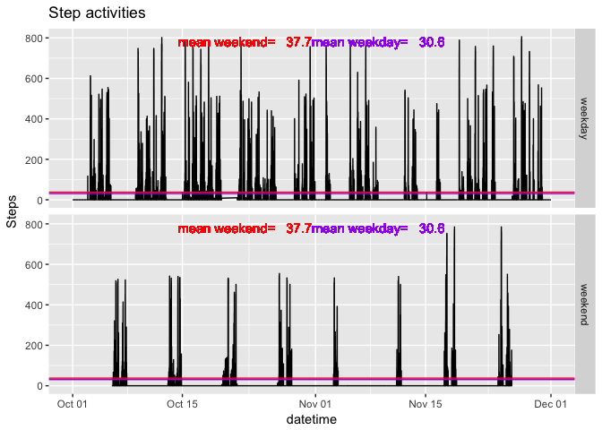

# Reproducible Research: Peer Assessment 1


## Loading and preprocessing the data
Graphing will be done with ggplot2.
Will use melt command from reshape2.
Will use wday (day of the week) from lubridate.
Will use mutate from dplyr

```r
library(ggplot2)
```

```
## Warning: package 'ggplot2' was built under R version 3.2.5
```

```r
library(reshape2)
```

```
## Warning: package 'reshape2' was built under R version 3.2.5
```

```r
library(lubridate)
```

```
## Warning: package 'lubridate' was built under R version 3.2.5
```

```
## 
## Attaching package: 'lubridate'
```

```
## The following object is masked from 'package:base':
## 
##     date
```

```r
library(dplyr)
```

```
## Warning: package 'dplyr' was built under R version 3.2.5
```

```
## 
## Attaching package: 'dplyr'
```

```
## The following objects are masked from 'package:lubridate':
## 
##     intersect, setdiff, union
```

```
## The following objects are masked from 'package:stats':
## 
##     filter, lag
```

```
## The following objects are masked from 'package:base':
## 
##     intersect, setdiff, setequal, union
```

### 1. Load the data (i.e. read.csv())

Read the activity.csv file from the doc directory.

```r
step_data <- read.csv("doc/activity.csv")
```

### 2. Process/transform the data (if necessary) into a format suitable for your
analysis

Set the date column to be Date type.
Parse the interval by:
- padding zeros on the left side to all are 4 characters long
- format in hh:mm format

Create a datetime column to be POSIXct type with date and time information.
To confirm the data are loaded, view the structure of the data.


```r
step_data$date <- as.Date(step_data$date)
padded_interval <- sprintf("%04d", step_data$interval)
step_data$interval <- paste(substr(sprintf("%04d", step_data$interval), 1, 2), 
                           ":", 
                           substr(sprintf("%04d", step_data$interval), 3, 4), 
                           sep = "")

step_data$datetime <- as.POSIXct(paste(step_data$date, step_data$interval ))
str(step_data)
```

```
## 'data.frame':	17568 obs. of  4 variables:
##  $ steps   : int  NA NA NA NA NA NA NA NA NA NA ...
##  $ date    : Date, format: "2012-10-01" "2012-10-01" ...
##  $ interval: chr  "00:00" "00:05" "00:10" "00:15" ...
##  $ datetime: POSIXct, format: "2012-10-01 00:00:00" "2012-10-01 00:05:00" ...
```


## What is mean total number of steps taken per day?

### 1. Make a histogram of the total number of steps taken each day

Based on the dates, the totals for each day can be combined with tapply.  Melt was used to convert
the array to a dataframe for plotting.

Column names are set (date and steps)

Totals steps for each day are plotted.  Bar colors are assigned by day of the week.

A horizontal line is drawn to represent the overall mean of daily steps.  

*Note: NAs are ignored in the calculation of sum and means*


```r
# take sums by date and transform to dataframe
total_daily <- melt(tapply(step_data$steps, step_data$date, sum, na.rm = TRUE))
# rename columns
colnames(total_daily) <- c("date", "steps")
# change format type to Date
total_daily$date <- as.Date(total_daily$date)
summary(total_daily)
```

```
##       date                steps      
##  Min.   :2012-10-01   Min.   :    0  
##  1st Qu.:2012-10-16   1st Qu.: 6778  
##  Median :2012-10-31   Median :10395  
##  Mean   :2012-10-31   Mean   : 9354  
##  3rd Qu.:2012-11-15   3rd Qu.:12811  
##  Max.   :2012-11-30   Max.   :21194
```

### 2. Calculate and report the mean and median total number of steps taken per day


```r
# calculate overall mean and median of daily total steps
mean_daily_steps <- mean(total_daily$steps, na.rm = TRUE)
median_daily_steps <- median(total_daily$steps, na.rm = TRUE)

# format text for graph
mean_steps_text = paste("mean =  ", sprintf("%.1f", mean_daily_steps))
median_steps_text = paste("median =  ", sprintf("%.1f", median_daily_steps))

#ggplot(total_daily) + geom_col(aes(date, steps, fill=wday(date))) + labs(title="Total daily steps", y = "Steps") +geom_hline(yintercept = mean(total_daily$steps, na.rm = TRUE)) + theme(legend.position = "none")

# generate plot
ggplot(total_daily) +
  geom_col( aes(date, steps, fill=wday(date))) +  # choose data to plot, color by day of the week
  labs(title="Total daily steps", y = "Steps") +  # set labels
  theme(legend.position = "none") +               # hide legend
  geom_hline(yintercept = mean_daily_steps, color = "red") +     # draw horizontal line for the mean
  geom_text(aes(x = min(total_daily$date) + 5,   # position text
                y = max(total_daily$steps), 
                label = mean_steps_text,          # text 
                vjust = 4), 
            color = "red") +
  geom_hline(yintercept = median_daily_steps, color = "purple") +     # draw horizontal line for the median
  geom_text(aes(x = min(total_daily$date) + 25,   # position text
                y = max(total_daily$steps), 
                label = median_steps_text,          # text 
                vjust = 4), 
            color = "purple")
```

<!-- -->

The mean number of daily steps is:

```r
mean_daily_steps
```

```
## [1] 9354.23
```
The median number of daily steps is:

```r
median_daily_steps
```

```
## [1] 10395
```

## What is the average daily activity pattern?

### 1. Make a time series plot (i.e. type = "l") of the 5-minute interval (x-axis) and the average number of steps taken, averaged across all days (y-axis)

Although it does not change how the plot looks, we generate the dataset with steps as NA removed.

```r
step_data_nona <- subset(step_data, !is.na(steps))
```

Here we calculate average steps taken per 5 minute interval.

```r
mean_interval_steps <- mean(step_data$steps, na.rm = TRUE)
mean_interval_text = paste("mean =  ", sprintf("%.1f", mean_interval_steps))
```

Plot:

```r
# generate plot
ggplot(step_data_nona) +
  geom_path( aes(datetime, steps)) +  # choose data to plot, color by day of the week
  labs(title="Step activities", y = "Steps") + # set labels
  geom_hline(yintercept = mean_interval_steps, color = "red") +     # draw horizontal line for the mean
  geom_text(aes(x = mean(step_data_nona$datetime),   # position text
                y = max(step_data_nona$steps), 
                label = mean_interval_text,          # text 
                hjust = "middle",
                vjust = "top"), 
            color = "red") 
```

<!-- -->

            
            
### 2. Which 5-minute interval, on average across all the days in the dataset, contains the maximum number of steps?

The interval with maximum steps is here:

```r
max_steps <- step_data_nona[step_data_nona$steps == max(step_data_nona$steps) ,]
```

## Imputing missing values

### 1. Calculate and report the total number of missing values in the dataset
### (i.e. the total number of rows with NAs)

Number of rows with NAs:

```r
sum(is.na(step_data$steps))
```

```
## [1] 2304
```

### 2. Devise a strategy for filling in all of the missing values in the dataset. The strategy does not need to be sophisticated. For example, you could use the mean/median for that day, or the mean for that 5-minute interval, etc.

It would be useful to better understand the source of the NAs:

- if they were due to taking the watch off device off to conduct a sedentary activity, like sleep or shower, it could be better to set NAs to 0.

- without prior knowledge,

    - we can use the mean or median for the day or the whole 2 months.  
    - since data are presented as the sum for each 5 minute interval, I'm not sure how the mean of that interval can be used to fill in the NA.
    - in some cases, it appears that there are days without measurements so the daily mean/median can not be used.
    - Finally, I will default to the median values instead of the means in case of outliers when few other data points are available.

- For this, I will use the median of the whole period, prior to filling NAs, to fill in NAs.

    - This would account for things like hardware issues like a sensitive accelerometer generating high baselines overall.
    - This does not compensate for things like weather issues affecting activity over days. 

### 3. Create a new dataset that is equal to the original dataset but with the missing data filled in.
Calculate the median of the entire dataset.

```r
median_steps_overall <- median(step_data$steps, na.rm = TRUE)
```

Calculate daily medians, transform to dataframe, set column names, and summary to check.

```r
daily_medians <- melt(tapply(step_data$steps, step_data$date, median, na.rm = TRUE))
colnames(daily_medians) <- c("date", "steps")
summary(daily_medians)
```

```
##          date        steps  
##  2012-10-01: 1   Min.   :0  
##  2012-10-02: 1   1st Qu.:0  
##  2012-10-03: 1   Median :0  
##  2012-10-04: 1   Mean   :0  
##  2012-10-05: 1   3rd Qu.:0  
##  2012-10-06: 1   Max.   :0  
##  (Other)   :55   NA's   :8
```

*Note: it turns out that none of this is interesting because all the values are 0. *

Substitute NAs with median_steps_overall


```r
step_data["steps"][is.na(step_data$steps),] <- median_steps_overall
```

### 4. Make a histogram of the total number of steps taken each day and Calculate and report the mean and median total number of steps taken per day. Do these values differ from the estimates from the first part of the assignment? What is the impact of imputing missing data on the estimates of the total daily number of steps?

Reusing code from part 1:

```r
# take sums by date and transform to dataframe
total_daily <- melt(tapply(step_data$steps, step_data$date, sum))
# rename columns
colnames(total_daily) <- c("date", "steps")
# change format type to Date
total_daily$date <- as.Date(total_daily$date)
str(total_daily)
```

```
## 'data.frame':	61 obs. of  2 variables:
##  $ date : Date, format: "2012-10-01" "2012-10-02" ...
##  $ steps: num  0 126 11352 12116 13294 ...
```

```r
# calculate overall mean and median of daily total steps
mean_daily_steps <- mean(total_daily$steps)
median_daily_steps <- median(total_daily$steps)

# format text for graph
mean_steps_text = paste("mean =  ", sprintf("%.1f", mean_daily_steps))
median_steps_text = paste("median =  ", sprintf("%.1f", median_daily_steps))

#ggplot(total_daily) + geom_col(aes(date, steps, fill=wday(date))) + labs(title="Total daily steps", y = "Steps") +geom_hline(yintercept = mean(total_daily$steps, na.rm = TRUE)) + theme(legend.position = "none")

# generate plot
ggplot(total_daily) +
  geom_col( aes(date, steps, fill=wday(date))) +  # choose data to plot, color by day of the week
  labs(title="Total daily steps", y = "Steps") +  # set labels
  theme(legend.position = "none") +               # hide legend
  geom_hline(yintercept = mean_daily_steps, color = "red") +     # draw horizontal line for the mean
  geom_text(aes(x = min(total_daily$date) + 5,   # position text
                y = max(total_daily$steps), 
                label = mean_steps_text,          # text 
                vjust = 4), 
            color = "red") +
  geom_hline(yintercept = median_daily_steps, color = "purple") +     # draw horizontal line for the median
  geom_text(aes(x = min(total_daily$date) + 25,   # position text
                y = max(total_daily$steps), 
                label = median_steps_text,          # text 
                vjust = 4), 
            color = "purple")
```

<!-- -->

This is not surprising because the NAs were filled with 0s, as this was the median value. 
Since 0s were added to the total daily steps, it does not change the totals values.
Also, for any days that were all NAs in the previous dataset, the sum would have still been 0 for the day.
If the mean was used to fill NAs, this would have changed.


## Are there differences in activity patterns between weekdays and weekends?

### 1. Create a new factor variable in the dataset with two levels – “weekday” and “weekend” indicating whether a given date is a weekday or weekend day.

Applying wday to the date, if it is 1 or 7, it would be Sunday or Saturday, respectively.
Use a ternary operator to assign "weekend" if wday returns 1 or 7, "weekday" otherwise.


```r
step_data$daytype <- ifelse(wday(step_data$date) == 1 | wday(step_data$date) == 7, "weekend", "weekday")
step_data$daytype <- as.factor(step_data$daytype)
summary(step_data)
```

```
##      steps             date              interval        
##  Min.   :  0.00   Min.   :2012-10-01   Length:17568      
##  1st Qu.:  0.00   1st Qu.:2012-10-16   Class :character  
##  Median :  0.00   Median :2012-10-31   Mode  :character  
##  Mean   : 32.48   Mean   :2012-10-31                     
##  3rd Qu.:  0.00   3rd Qu.:2012-11-15                     
##  Max.   :806.00   Max.   :2012-11-30                     
##     datetime                      daytype     
##  Min.   :2012-10-01 00:00:00   weekday:12960  
##  1st Qu.:2012-10-16 05:58:45   weekend: 4608  
##  Median :2012-10-31 11:57:30                  
##  Mean   :2012-10-31 12:23:59                  
##  3rd Qu.:2012-11-15 17:56:15                  
##  Max.   :2012-11-30 23:55:00
```

### 2. Make a panel plot containing a time series plot (i.e. type = "l") of the 5-minute interval (x-axis) and the average number of steps taken, averaged across all weekday days or weekend days (y-axis). The plot should look something like the following, which was creating using simulated data:

First calculate mean steps for weekends and weekdays

```r
mean_weekend_steps <- mean(subset(step_data, daytype == "weekend")$steps)
mean_weekday_steps <- mean(subset(step_data, daytype == "weekday")$steps)
mean_weekend_text = paste("mean weekend=  ", sprintf("%.1f", mean_weekend_steps))
mean_weekday_text = paste("mean weekday=  ", sprintf("%.1f", mean_weekday_steps))
```

Then plot data


```r
ggplot(step_data) +
  geom_path( aes(datetime, steps)) +  # choose data to plot, color by day of the week
  labs(title="Step activities", y = "Steps") + # set labels
  geom_hline(yintercept = mean_weekend_steps, color = "red") +     # draw horizontal line for the mean
  geom_text(aes(x = mean(step_data$datetime),   # position text
                y = max(step_data$steps), 
                label = mean_weekend_text,          # text 
                hjust = "right",
                vjust = "top"), 
            color = "red") +
  geom_hline(yintercept = mean_weekday_steps, color = "purple") +     # draw horizontal line for the mean
  geom_text(aes(x = mean(step_data$datetime),   # position text
                y = max(step_data$steps), 
                label = mean_weekday_text,          # text 
                hjust = "left",
                vjust = "top"), 
            color = "purple") 
```

<!-- -->
